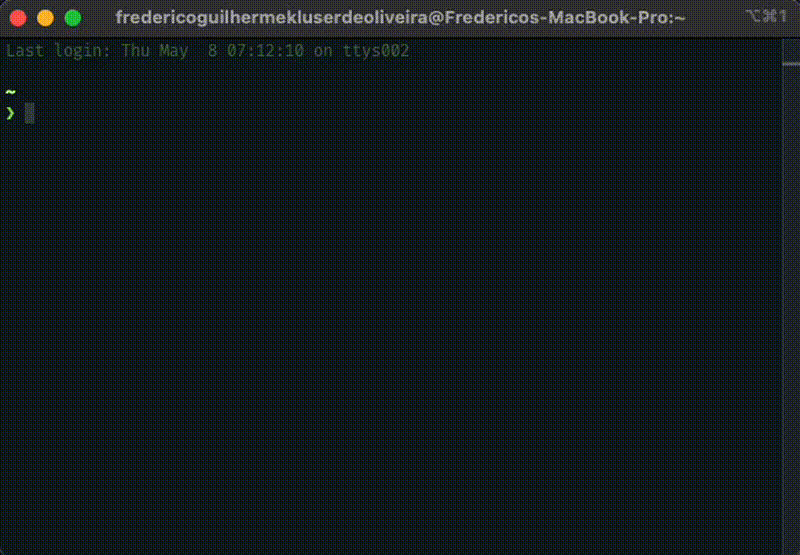

# 🧠 Цифровой дождь из Матрицы 🌧️



> _"К сожалению, никто не может объяснить, что такое Матрица. Ты должен увидеть это сам."_ - Морфеус

Терминальная анимация цифрового дождя из Матрицы, воссоздающая культовый эффект "цифрового дождя" из
фильмов Матрица прямо в вашем терминале. Выбери красную таблетку 💊 и узнай, насколько глубока
кроличья нора...

_Читать на других языках: [English](README.en.md), [Português](README.pt-br.md),
[Español](README.es.md), [Français](README.fr.md), [Deutsch](README.de.md), [中文](README.zh.md),
[日本語](README.ja.md), [Русский](README.ru.md), [العربية](README.ar.md), [हिन्दी](README.hi.md)_

## ✨ Особенности

- 📊 Завораживающие падающие символы в стиле Матрицы (катакана, цифры и буквы)
- 💬 Центрированное отображение сообщений ("THE MATRIX HAS YOU")
- ⏯️ Пауза/возобновление с помощью пробела (заморозить время в Матрице)
- 📝 Поддержка собственных начальных сообщений (стань своим собственным Оракулом)
- 🔄 API для отображения сообщений для создания последовательностей с таймерами или интерактивных
  отображений
- 🐇 Следуй за белым кроликом с интерактивным управлением

## 💾 Установка

### Как глобальный инструмент командной строки

```bash
# Установить глобально
npm install -g the-matrix-rain

# Запустить анимацию Matrix rain
matrix-rain

# Запустить с пользовательским сообщением
matrix-rain "FOLLOW THE WHITE RABBIT"

# Показать случайные цитаты из Матрицы
matrix-rain --random

# Запустить в интерактивном режиме
matrix-rain --interactive

# Запустить на определенное время (в секундах)
matrix-rain --time 30

# Для справки и дополнительных опций
matrix-rain --help
```

> **Примечание**: После глобальной установки команда `matrix-rain` будет доступна из любого
> терминала. Не нужно вручную запускать `node index.js`!

### Как зависимость проекта

```bash
# Добавить в ваш проект
npm install the-matrix-rain

# ИЛИ
yarn add the-matrix-rain
```

### Из исходного кода

```bash
# Освободи свой разум...
git clone https://github.com/frederico-kluser/the-matrix-rain.git
cd the-matrix-rain
npm install
```

## 🕹️ Использование

### Параметры командной строки

После глобальной установки вы можете использовать следующие параметры командной строки:

```bash
# Запустить с сообщением по умолчанию "WAKE UP NEO"
matrix-rain

# Запустить с пользовательским сообщением
matrix-rain "FOLLOW THE WHITE RABBIT"

# Запустить на определенное время (в секундах)
matrix-rain --time 30

# Показать случайные цитаты из Матрицы
matrix-rain --random

# Интерактивный режим - введите сообщения для отображения
matrix-rain --interactive

# Показать справку
matrix-rain --help
```

### Основное использование

Функция `matrixRain` возвращает Promise, поэтому она должна использоваться с async/await или
цепочками Promise:

```javascript
const matrixRain = require('the-matrix-rain');

// Пример с async/await (Ложки не существует)
async function startMatrix() {
  // Запуск с сообщением по умолчанию "WAKE UP NEO" или пользовательским сообщением
  const matrix = await matrixRain(); // или await matrixRain("ПОЛЬЗОВАТЕЛЬСКОЕ СООБЩЕНИЕ");

  // Отображение пользовательского сообщения
  matrix.display('THE MATRIX HAS YOU');

  // Остановка анимации по завершении (выход из конструкции)
  matrix.stop();
}

// Вызов асинхронной функции
startMatrix();

// Альтернатива с использованием синтаксиса Promise (Помни... всё, что я предлагаю - это правда)
matrixRain().then(matrix => {
  matrix.display('THE MATRIX HAS YOU');

  // Позже остановить анимацию
  setTimeout(() => matrix.stop(), 5000);
});
```

### NPM скрипты

Проект включает несколько npm скриптов для запуска примеров:

```bash
# Запустить базовый пример (вариант с синей таблеткой)
npm run example:basic

# Запустить с пользовательским начальным сообщением (Говори как Оракул)
npm run example:custom

# Запустить последовательность сообщений с таймером (Как разговор с Архитектором)
npm run example:sequence

# Запустить интерактивный режим - введите сообщения для отображения (Будь своим собственным Агентом)
npm run example:interactive

# Запустить со случайными цитатами из Матрицы (Как дежавю в Матрице)
npm run example:quotes

# Список доступных примеров (Что, если я скажу тебе...)
npm run examples
```

## 🧪 Примеры

Каталог `/examples` содержит различные демонстрации, показывающие разные способы использования
анимации Matrix Rain. Вы можете запустить эти примеры, используя npm скрипты, перечисленные выше.

- `examples/basic.js` - Простой пример со стандартным начальным сообщением
- `examples/custom-initial.js` - Пример с пользовательским начальным сообщением (как выбор своей
  собственной красной таблетки)
- `examples/timed-sequence.js` - Последовательность сообщений с таймером (сбои в Матрице)
- `examples/interactive.js` - Введите сообщения для отображения во время запуска (стань Избранным)
- `examples/random-quotes.js` - Показывает случайные цитаты из фильма Матрица (мудрость Зиона)

Каждый пример демонстрирует различные функции анимации Matrix Rain. Чтобы запустить пример напрямую:

```bash
node examples/interactive.js
```

## 🔌 API

### matrixRain([initialMessage])

Запускает анимацию цифрового дождя из Матрицы.

- `initialMessage` (опционально): Пользовательское сообщение для начального отображения (по
  умолчанию: "WAKE UP NEO")
- Возвращает: Promise, разрешающийся в объект с методами `display` и `stop`

### matrix.display(message)

Отображает сообщение в центре экрана (как сбой в Матрице).

- `message`: Строка для отображения

### matrix.stop()

Останавливает анимацию и очищает терминал (выход из Матрицы).

## 🎮 Управление

- `Пробел`: Пауза/возобновление анимации (заморозить Матрицу)
- `M`: Показать сообщение "MATRIX HAS YOU" (почувствуй дежавю)
- `Ctrl+C`: Выход из приложения (принять синюю таблетку)

## 🔓 Лицензия

MIT

---

> _"Я знаю кунг-фу."_ - Нео
